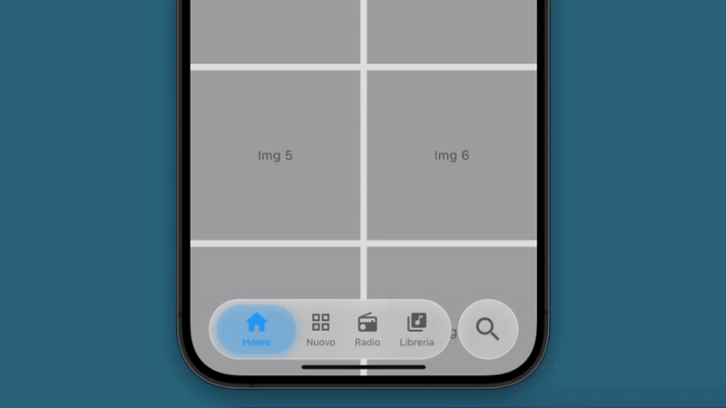

# iOS 26 Liquid Glass Navbar (Flutter Clone)

Un progetto Flutter che imita la nuova navigation bar introdotta in iOS 26, caratterizzata dallo stile "Liquid Glass": un design traslucido, fluido e animato che si adatta dinamicamente al contenuto e all'interazione utente.

## ✨ Caratteristiche

- UI ispirata alla navbar di iOS 26 con effetto Liquid Glass
- Transizioni fluide e animazioni su scroll/interazione
- Supporto per tema chiaro/scuro
- Personalizzabile e modulare
- Compatibile con dispositivi iOS e Android

## 🌐 Screenshot

 <!-- Sostituisci con un'immagine reale del progetto -->

## ⚙️ Requisiti

- Flutter 3.16 o superiore
- Dart 3.2 o superiore

## 🚀 Avvio rapido

```bash
# Clona la repository
git clone https://github.com/tuo-username/ios26-liquid-navbar-flutter.git
cd ios26-liquid-navbar-flutter

# Installa le dipendenze
flutter pub get

# Avvia l'app su un simulatore o dispositivo reale
flutter run
```

## 🎓 Tecnologie utilizzate

- **Flutter** per lo sviluppo cross-platform
- **BackdropFilter** per effetto blur
- **AnimatedContainer** e **CustomPainter** per animazioni fluide
- **Cupertino widgets** per rispettare le linee guida iOS

## ⚖️ Licenza

Questo progetto è distribuito sotto licenza MIT. Vedi il file `LICENSE` per maggiori dettagli.

## 🙋‍ Contatti

Per suggerimenti, segnalazioni o collaborazioni:

- GitHub: [@Cristian-Porco](https://github.com/Cristian-Porco)

---

Realizzato con ❤️ per chi ama un design raffinato e moderno.
